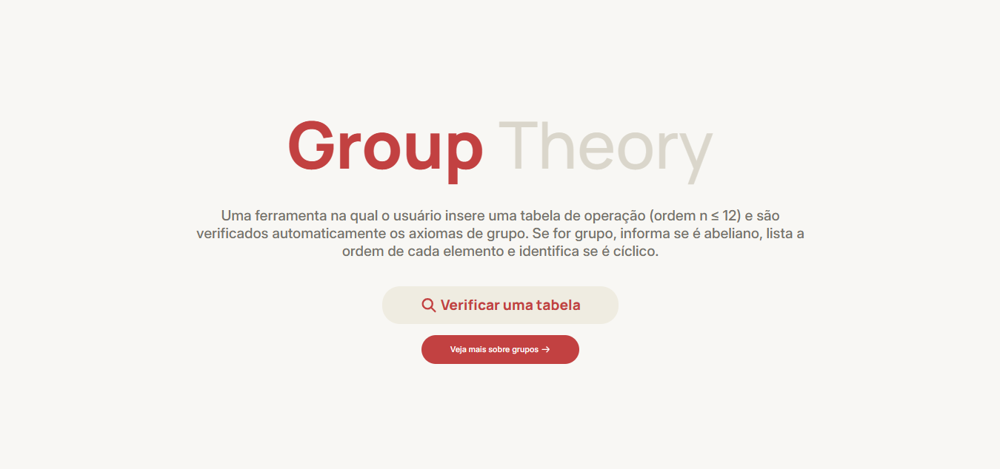

# Verificador de Estruturas de Grupos

> Sistema web projetado como atividade avaliativa para a disciplina Fundamentos de Matemática para a Ciência da Computação II.

## 🎯 Especificação

O usuário insere uma tabela de operação (ordem n ≤ 12) e o programa verifica automaticamente os axiomas de grupo — fechamento, associatividade, elemento neutro e inversos — apontando exatamente qual axioma falha e em quais elementos. Se for grupo, informa se é abeliano, lista a ordem de cada elemento e identifica se é cíclico. Interface destaca visualmente as violações na tabela. 

## 📐 Sobre Estruturas de Grupos

Na Matemática Discreta, um **grupo** é um conjunto $G$ equipado com uma operação binária $*$ que obrigatoriamente satisfaz quatro axiomas:

* **Fechamento:** O resultado da operação entre quaisquer elementos pertence ao próprio conjunto.
* **Associatividade:** A ordem em que a operação é aplicada não altera o resultado final: $(a * b) * c = a * (b * c)$.
* **Elemento Neutro:** Existe um elemento $e \in G$ tal que sua operação com qualquer $a$ resulte no próprio $a$ ($a * e = e * a = a$).
* **Elementos Inversos:** Cada elemento $a \in G$ possui um simétrico/inverso correspondente $a^{-1} \in G$ no conjunto ($a * a^{-1} = e$).

## 🛠️ Ferramentas Utilizadas

* **Python:** Responsável pelo processamento de matrizes e algoritmo de validação dos axiomas.
* **Flask:** Framework web estrutural para gerenciamento de rotas e integração.
* **HTML, CSS e JavaScript:** Utilizados na construção do design da interface e interatividade do site.

## ☕ Usando o Verificador de Grupos

Para usar o projeto, basta navegar pelo site através do [link do projeto](https://seu-link-aqui.vercel.app/) e explorar suas funcionalidades!

## 🌳 Discentes
[🍓  laragevan](https://github.com/laragevan)   
[🍋 SEMZluis](https://github.com/SEMZluis)  
[🍊 sofiacpaiva](https://github.com/sofiacpaiva)